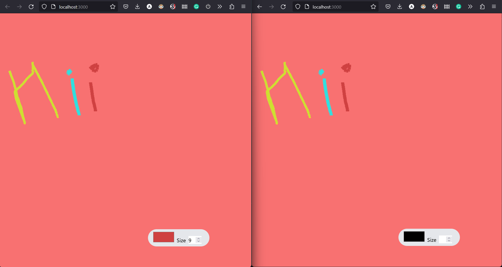

# Bored

As the name implies i was really bored and decided to make this for fun and to learn a bit of Next.js.

While making this I had one thing in mind and that was a simple and clean design where people can just share their thoughts in the form of drawings.

So I began with a one to one session kind of design which I have future plans for.

## Current state
<!-- add a pic from directory called bored.png -->

## Future Plans
<!-- bulleted list -->
* Host it somewhere
* Add a chat feature
* Drawings can be saved and shared
* Saves can occur on the machine and on a remote database
* Drawings can be like tweets and people can see and react to them
* Add a login feature
